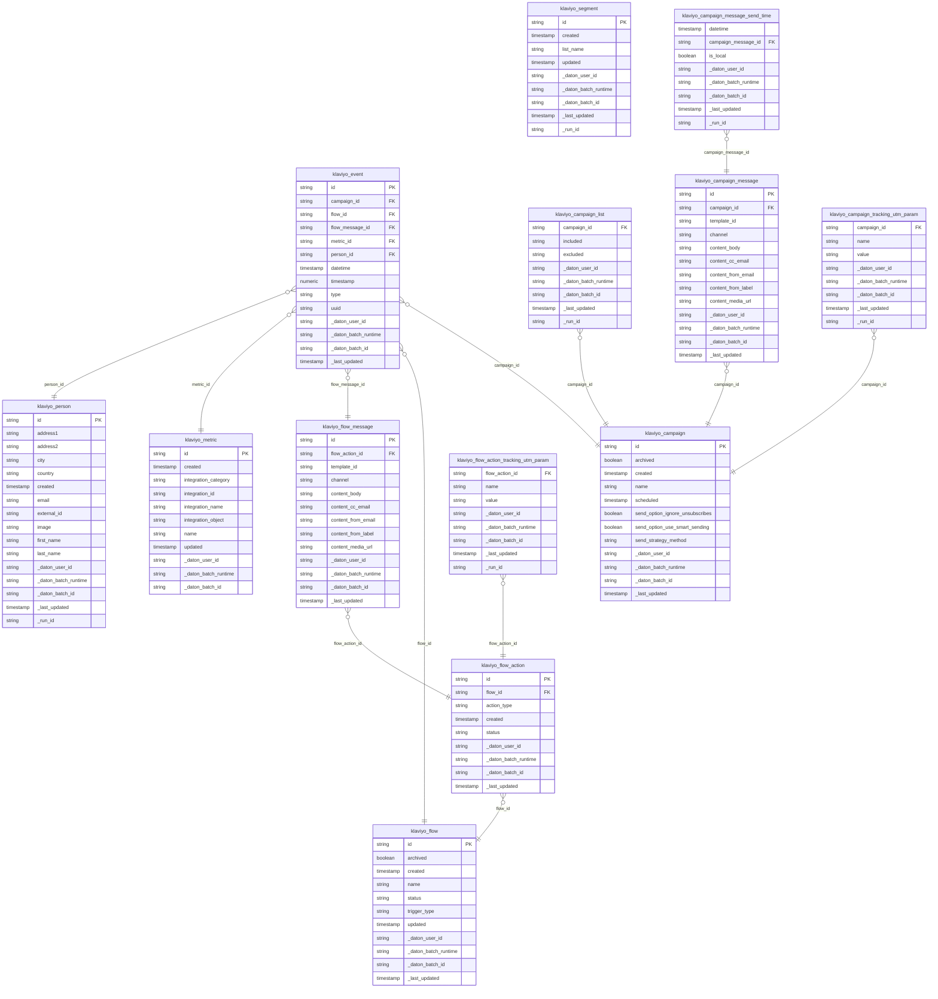

# Project Documentation

## Release Notes: Klaviyo

### Overview
This release introduces a package that delivers the exact same dbt models as provided by Fivetran’s Klaviyo integration, now powered by Daton as the data source. The models’ structure, logic, and outputs are fully aligned with the Fivetran Klaviyo dbt package, ensuring seamless compatibility for all downstream analytics and reporting. The current release supports Big Query as the warehouse to which Daton is loading into.

### Key Highlights
- **Source Substitution Only**: The package is set to replicate the raw tables loaded by fivetran to warehouse. No modifications have been made to the model logic or structure. 
- **Seamless Integration**: Downstream queries, dashboards, and data products built on top of these models will work without any changes.
- **Best Practices**: The package follows dbt and analytics engineering best practices, including robust testing, documentation, and incremental loading where applicable.

### Model List
| Model Name                        | Description                                              |
|:----------------------------------|:---------------------------------------------------------|
| klaviyo_event                     | A list of events associated with the account             |
| klaviyo_campaign                  | A list of campaigns associated with the account          |
| klaviyo_campaign_list             | A list of campaign lists associated with the account     |
| klaviyo_campaign_message          | A list of campaign messages associated with the account  |
| klaviyo_campaign_message_send_time| A list of campaign message send times associated with the account |
| klaviyo_campaign_tracking_utm_param| A list of campaign tracking UTM parameters associated with the account |
| klaviyo_flow                      | A list of flows associated with the account              |
| klaviyo_flow_action               | A list of flow actions associated with the account       |
| klaviyo_flow_action_tracking_utm_param| A list of flow action tracking UTM parameters associated with the account |
| klaviyo_flow_message              | A list of flow messages associated with the account      |
| klaviyo_metric                    | A list of metrics associated with the account            |
| klaviyo_person                    | A list of persons associated with the account            |
| klaviyo_segment                   | A list of segments associated with the account           |

## Entity Relationship Diagram (ERD)

Below is the ERD for the Klaviyo models in this package. This diagram shows the tables, their columns, and the relationships between them. You can visualize this diagram using Mermaid in supported markdown viewers.


### Migration Notes
- **No Action Required**: Consumers of these models do not need to update queries or dashboards, as all output remains identical to the Fivetran-based package.
- **Configuration**: Ensure your `dbt_project.yml` and source configurations reference Daton as the source for Klaviyo data.
- **Validation**: All standard dbt tests (e.g., `unique`, `not null`) are in place to ensure data integrity.


## DBT Tests

The tests property defines assertions about a column, table, or view. The property contains a list of generic tests, referenced by name, which can include the four built-in generic tests available in dbt. For example, you can add tests that ensure a column contains no duplicates and zero null values. Any arguments or configurations passed to those tests should be nested below the test name.

| **Tests**  | **Description** |
| ---------------| ------------------------------------------- |
| [Not Null Test](https://docs.getdbt.com/reference/resource-properties/tests#testing-an-expression)  | This test validates that there are no null values present in a column |
| [Data Recency Test](https://github.com/dbt-labs/dbt-utils/blob/main/macros/generic_tests/recency.sql)  | This is used to check for issues with data refresh within {{ x }} days, please specify the value of number of days at {{ x }} |
| [Accepted Value Test](https://docs.getdbt.com/reference/resource-properties/tests#accepted_values)  | This test validates that all of the values in a column are present in a supplied list of values. If any values other than those provided in the list are present, then the test will fail, by default it consists of default values and this needs to be changed based on the project |
| [Uniqueness Test](https://docs.getdbt.com/reference/resource-properties/tests#testing-an-expression)  | This test validates that there are no duplicate values present in a field |


---

## Prerequisites for Fivetran to Daton dbt Package

- [Daton integration for Klaviyo](https://www.sarasanalytics.com/daton/klaviyo)

### Supported Data Warehouses
- BigQuery

---

## Configuration for dbt Package

### Required Variables
This dbt package assumes that you have an existing dbt project with a BigQuery/Snowflake profile connected & tested.

Set the following in your `dbt_project.yml` file:

```yaml
vars:
  raw_database: "your_database"
  raw_schema: "your_schema"
```

### Other Configurable Variables

In addition to `raw_database` and `raw_schema`, you can configure the following variables in your `dbt_project.yml` file:

#### Model Enable/Disable Flags
Set these to `true` or `false` to enable or disable specific models:

- `klaviyo_event`
- `klaviyo_flow_action`
- `klaviyo_flow_message`
- `klaviyo_flow_action_tracking_utm_param`
- `klaviyo_campaign_tracking_utm_param`
- `klaviyo_person`
- `klaviyo_segment`
- `klaviyo_campaign_list`
- `klaviyo_metric`
- `klaviyo_flow`
- `klaviyo_campaign`
- `klaviyo_campaign_message`
- `klaviyo_campaign_message_send_time`

#### Raw Table Pattern Variables
Override these to change the pattern used to find the raw data tables for each model:

- `klaviyo_event_table_pattern`
- `klaviyo_flow_action_table_pattern`
- `klaviyo_flow_message_table_pattern`
- `klaviyo_flow_action_tracking_utm_param_table_pattern`
- `klaviyo_campaign_tracking_utm_param_table_pattern`
- `klaviyo_person_table_pattern`
- `klaviyo_segment_table_pattern`
- `klaviyo_campaign_list_table_pattern`
- `klaviyo_metric_table_pattern`
- `klaviyo_flow_table_pattern`
- `klaviyo_campaign_table_pattern`
- `klaviyo_campaign_message_table_pattern`
- `klaviyo_campaign_message_send_time_table_pattern`

Refer to the `dbt_project.yml` file for the default values and update as needed for your environment.
